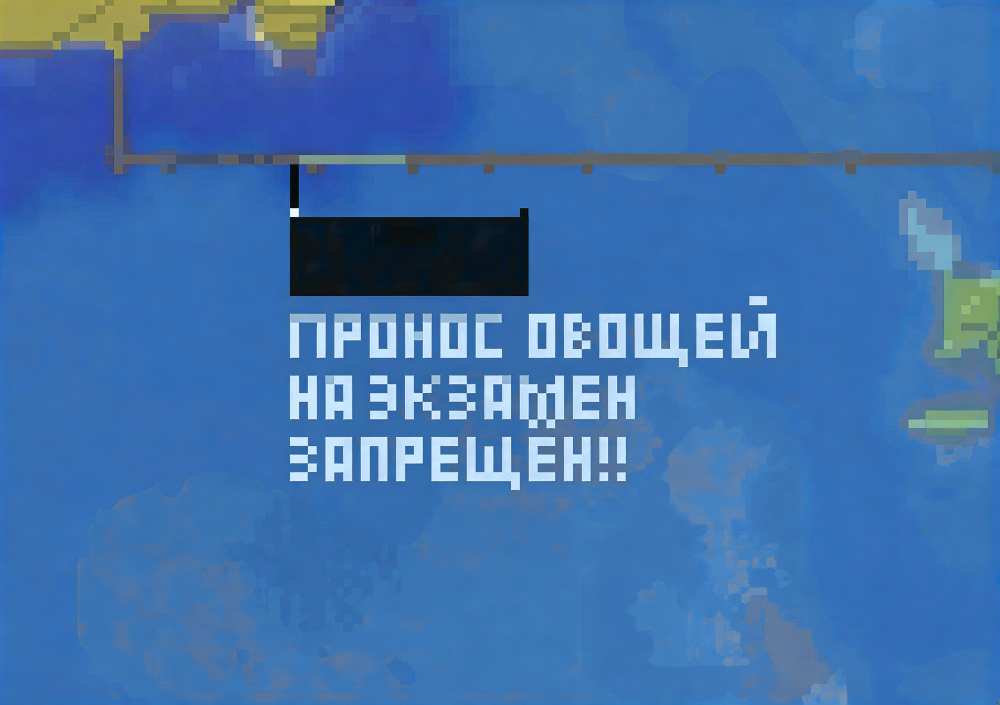

# Minecraft schematic text generator


  




## Quick start
```bash
git clone https://github.com/MakarMolochaev/mc-text-gen.git
cd mc-text-gen
make deps
make run
```

.litematic file will appear in [export](export/) folder
btw now you can edit [main.go](/cmd/mc-gen/main.go) and change the generating text

## editing a font and creating your own

fonts stored in [fonts](fonts/) folder.  
The *human-readable* format makes it relatively easy to add your own characters and create your own fonts.  
Each font file contains *header*:
```yaml
name: "<font name>"
register-support: false    #this parameter isn't using now
line-height: 7             #max letter Y size, aka Line Height
```

Next, there is a list with symbols:
```yaml
  - symbol: "<symbol character>"
    sizeX: 3                    #size in blocks by X
    sizeY: 5                    #size in blocks by Y
    bias: 0                     #optional parameter, vertical bias. recommended use between -sizeY and +sizeY (recommended not use)
    scheme: "111101101111101"   #flattened letter scheme
```
For example, scheme "111101111101101" corresponds the letter А (cyrillic)
```
██████
██  ██
██████
██  ██
██  ██
```

ok that's all, 67